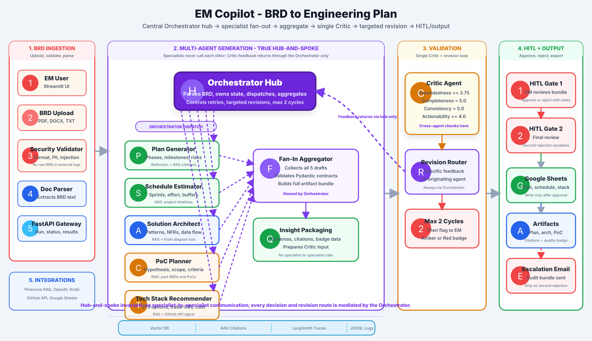

# From BRD to Engineering Plan in 50 Seconds

### Building EM Copilot - a 7-agent AI system that turns a Business Requirements Document into a complete, validated engineering plan in under a minute, for about thirty cents.

---

Every Software Engineering team I've worked with knows the rhythm.

A Business Requirements Document lands in your inbox on Monday - fifteen pages of stakeholder hopes - and the next two or three days disappear. You read it. You draft a plan. You sketch an architecture. You estimate effort. You look at past projects for tech-stack patterns. You convene the team for a scoping session. Two or three EMs handed the same BRD produce three different plans, because the output depends on who's drafting under what pressure on what day.

I spent fifteen years on this loop at Apple, Pfizer, Prudential, and other Fortune 500 engagements. The problem isn't capability - engineering managers are good at this. The problem is that *the work shouldn't take this long*, and *consistency shouldn't depend on individual stamina*.

So I built **EM Copilot** - an AI system that takes a BRD as input and returns a complete, internally-consistent planning bundle: engineering plan, project schedule, system architecture (with a rendered diagram), proof-of-concept scope, and tech-stack options with trade-offs. In under a minute. For about **31 cents** in OpenAI spend.

*Drop a BRD. Wait ~50 seconds. Get a complete engineering plan.*

It runs on seven coordinated agents, a Critic that scores every artifact against a four-dimensional scoring model, a human-in-the-loop approval gate (voice or button), and integrations that push the approved bundle to Jira, Google Sheets, and a downloadable PDF.

This post is the architectural tour, the honest tradeoffs, and the lessons earned the hard way.

---

## What it actually does

You drop a BRD (PDF, DOCX, or TXT) into the UI. Within roughly fifty seconds, the system returns:

- **Engineering Plan** - phases, milestones, team composition, top risks, dependencies
- **Project Schedule** - effort by phase, sprint breakdown, critical path, buffer weeks
- **System Architecture** - components, NFR mappings, deployment model, and a rendered Mermaid SVG diagram
- **PoC Scope** - hypothesis, in/out of scope, success criteria, team size, risk-if-fails
- **Tech Stack Options** - 2–3 candidates with scalability, familiarity, integration risk, monthly cost, pros/cons, and a recommended choice with rationale
- **Quality Badge** - Green / Amber / Red across four dimensions: groundedness, completeness, consistency, actionability

Every artifact carries citations to the source - either the BRD or organizational documents in the RAG knowledge base. Nothing is exported until you approve. On approval, the bundle pushes to **Jira** (as an Epic, created through an MCP server - more on that below), logs to a Google Sheets dashboard, and produces a downloadable PDF. On rejection, the decision is logged for audit. On pipeline error, a **Slack** alert fires.

The whole thing is built on **LangGraph** with strict **Pydantic** contracts at every agent boundary. There are no untyped LLM handoffs anywhere in the pipeline.

*All seven agents finished, Critic awards a Green badge at 4.55/5, every dimension at or above threshold.*

---

## Architecture: hub-and-spoke with a hard rule

The architecture is hub-and-spoke, but with an invariant I think is the single most important design decision in the system:

> **Specialists never talk to specialists. Every routing, every revision, every feedback path is mediated by the Orchestrator.**

The pipeline runs in four conceptual stages.

**1. Ingestion.** The BRD passes through a deterministic seven-check security layer: file format and size, word-count minimum, regex pattern matching for 15 known LLM injection strings, a semantic injection scan via GPT-4o-mini (catches multi-paragraph prompt injections that regex misses), PII redaction (SSN, credit cards, emails → `[REDACTED]`), and a completeness check that confirms the document actually contains Objectives, Requirements, Constraints, Risks, and NFRs. No raw BRD text ever leaves the pipeline; only a SHA-256 hash is logged.

**2. Orchestrator dispatch (Two-Pass Loop).** The Orchestrator runs the specialists in two distinct phases:
- **Pass 1 (Drafting):** Fans out to all five specialists in parallel using a `ThreadPoolExecutor` to generate initial drafts. This concurrency is what cuts wall-clock time from ~2.5 minutes (sequential) to under a minute.
- **Arbitration & Pass 2 (Alignment):** The Orchestrator evaluates the drafts. If alignment conflicts are found, it schedules a targeted Pass 2 rerun *only* on the violating specialists using custom directives, reusing the other drafts to save cost and latency. If consistency checks pass with 0 conflicts, the LLM arbitration and Pass 2 rerun are bypassed entirely.

The specialists:
- **Plan Generator** - reflection-based, with a self-critique pass
- **Schedule Estimator** - references historical project timelines from RAG and applies effort-scaling sanity checks
- **Solution Architect** - generates the Mermaid SVG diagram and architectural rationale
- **PoC Planner** - defines a focused proof-of-concept scope with measurable criteria
- **Tech Stack Recommender** - uses RAG and (when available) GitHub API velocity signals

Each specialist returns a Pydantic-typed output with required citations. An untyped or uncited output fails the contract - the schema enforces groundedness at the type system level.

**3. Aggregation and Critic.** A Fan-In Aggregator collects all aligned outputs and packages the combined state. A single **Critic Agent** then audits the *aggregate*, not each piece in isolation. That's the second crucial design decision.

**4. HITL and exports.** Approved artifacts flow to Jira (Epic via MCP), Google Sheets (full run + Plan/Schedule/Stack tabs), and a ReportLab PDF. Rejections log to Sheets as an audit row. Pipeline errors fire a Slack alert and log an error row.

---

## Why a single Critic - and why it has deterministic caps

I considered giving each specialist its own validator. I'm glad I didn't.

The single Critic catches a class of bug that per-agent validation cannot: **cross-artifact contradiction**. If the Schedule Estimator says "3 weeks total" and the Solution Architect specifies an event-driven mesh of ten microservices, neither output is *individually* wrong, but together they're nonsense. The Critic, working on the combined state, flags this as a consistency issue and routes only the affected agents back through the Orchestrator for a targeted revision - capped at two cycles to avoid infinite loops.

The Critic scores four dimensions on a 0–5 scale:

| Dimension | What it measures | Threshold |
|---|---|---|
| Groundedness | Does every claim trace to a citation? | ≥ 3.75 |
| Completeness | Are all BRD constraints addressed? | = 5.0 |
| Consistency | Do the artifacts agree with each other? | = 5.0 |
| Actionability | Could an engineer execute from this? | ≥ 4.0 |

But LLM-as-judge has a well-known failure mode: it tends to be optimistic. So the Critic's score is *not* the only signal. Three **deterministic failure-mode caps** override the LLM verdict when triggered:

- **FM-1 (Hallucination Guard)** - deducts 0.3 points per citation that doesn't match a real RAG chunk.
- **FM-2 (Uncited Claim Cap)** - if any specialist returns zero citations, the overall score is capped at **3.9 (Amber)** regardless of what the Critic LLM said.
- **FM-3 (Sentinel Fallback Cap)** - if any agent fell back to a placeholder due to an API failure (confidence ≤ 0.30), the score is capped at 3.9 and a consistency issue is flagged in the UI.

These caps cost almost nothing to implement, and they're the difference between an LLM toy and a system you can act on. They're the reason the badge actually *means* something.

The Critic's revision loop is the single most impactful feature in the system. Across my evaluation set, the average overall score improved from **3.38 (Amber) to 4.33 (Green)** after one critic cycle - a **+0.95 delta, one full badge tier**.

---

## MCP for Jira, not REST

The most architecturally interesting integration is the Jira push. The naive path is a REST `POST /rest/api/3/issue` - that's how I started, and it works. But it was also a missed opportunity.

The current design uses the **Model Context Protocol (MCP)**: the pipeline acts as an MCP *client* and spawns the open-source `mcp-atlassian` server as a stdio subprocess. The MCP handshake completes, available tools are discovered (`jira_create_issue`, `jira_get_issue`, etc.), and the Epic is created through `call_tool("jira_create_issue", issue_type="Epic", project_key="SCRUM", ...)`.

Two things make this worth the complexity. First, it's a real demonstration of MCP architecture - the same pattern lets you swap Jira for Linear, Confluence, or any other MCP-compatible tool with no code changes in the calling layer. Second, the failure mode is graceful: if the MCP server can't spawn or the tool call errors, `/approve` silently falls back to the REST integration. The Epic still gets created; the EM never sees a broken flow.

The journey to get this working taught me more than the working code did. `mcp-atlassian` 0.11.x has no `__main__.py`, so `python -m mcp_atlassian` fails - you have to use the console-script entry point. The MCP SDK passes the `env` dict to the subprocess **verbatim**, with no PATH/HOME merge - meaning the subprocess can't even find its own Python interpreter unless you merge `os.environ` in explicitly. The tool's `additional_fields` parameter is typed `dict[str, Any]`, not a JSON-encoded string, so passing `json.dumps({"labels": [...]})` silently fails server-side validation.

Each of these was a thirty-minute discovery. None of them is in the documentation.

*Mid-approval UI. Sheets export complete; MCP Jira push still creating the Epic. The "in progress" message replaced an earlier hardcoded "credentials not configured" fallback that fired whenever Jira data was simply absent - one of those quiet UX fixes that separates a demo from a system you trust.*

---

## Human-in-the-loop: voice and buttons

Every approval flows through a **HITL gate**. I deliberately kept this strict: nothing exports until a human says yes.

The gate supports two paths. The first is the obvious one - Approve/Reject buttons in the React UI, with a rating slider and a notes field. The second is more interesting: an **ElevenLabs conversational voice agent** is embedded in the page, primed at conversation start with a **compact briefing of the generated artifacts** passed via dynamic variables. The EM can ask "What's the total duration?" or "Why this tech stack?" - the agent answers from the briefing, then accepts a verbal "approve with rating five" command that fires a webhook to the `/approve` endpoint.

The artifact briefing was a late addition. Initially the voice agent could only approve - it knew nothing about *what* it was being asked to approve, which was useless. The fix was small: build a 1500-character plain-text summary of the generated artifacts (critic verdict, plan phases, top risks, schedule numbers, architecture pattern, PoC hypothesis, recommended stack) and hand it to the widget as an `{{artifact_brief}}` dynamic variable. The agent's system prompt references it, and suddenly voice goes from gimmick to legitimately useful. The EM can *interrogate the plan* in natural language before committing.

*The HITL gate during an active voice approval. The ElevenLabs widget (top right) shows the live conversation; the form below stays available as a fallback.*

---

## What it costs

A full run costs approximately **$0.31 USD** and consumes about **51,100 tokens**:

| Phase | Model | Tokens | Cost |
|---|---|---|---|
| Security validator | GPT-4o-mini | ~1.1K | ~$0.0002 |
| Orchestrator | GPT-4o-mini | ~2K | ~$0.0005 |
| 5 specialists (parallel) | GPT-4o | ~33K | ~$0.265 |
| Critic | GPT-4o-mini | ~11K | ~$0.0021 |
| **Total** | - | **~51K** | **~$0.31** |

The cost split is deliberate. **GPT-4o** for tasks that need genuine reasoning (the five specialists). **GPT-4o-mini** for orchestration, routing, security scanning, and critique - work where the model needs to follow structured instructions, not invent new analysis. That single decision cuts the run cost by roughly 4× with no measurable quality drop.

Parallel execution stays well inside the OpenAI Tier-1 rate limit (150K input tokens/min for GPT-4o), supporting up to three concurrent runs per minute.

*LangSmith Cost & Tokens dashboard - per-run cost, per-trace cost, output tokens, p50/p99 splits. The thirty-one-cent number isn't a claim; it's a measurement.*

---

## The lessons (the honest ones)

If you read no other section of this post, read this one.

**Token discipline beats raw vibe-coding.** Early on I tried to vibe-code the whole pipeline in one giant session. I ran out of context twice before learning my lesson. The version that shipped was built feature-by-feature across five days, each feature with its own implementation plan, its own commit, and its own test. Iterating in small, typed contracts let me move faster *because* I was moving slower.

**Reliable and responsible beats more features.** I had a list of fifteen integrations I could have added. I shipped seven. The five I cut weren't bad ideas - they were just lower-leverage than making the existing ones bulletproof. The FM-1/2/3 caps, the graceful Sheets-CSV fallback, the MCP-to-REST fallback, the "Jira push in progress…" message that replaced a misleading "credentials not configured" flash - none of those *add* a feature, but each one is the difference between a demo and a thing you'd hand to a peer.

**Observability is expensive but non-negotiable.** LangSmith gave me prompt/model/latency/token visibility I literally could not have lived without while debugging the Critic. It also cost more than I expected. For a production deployment, I'd want a cheaper telemetry layer for routine runs and LangSmith reserved for replay debugging.

*A full LangSmith trace of one run: orchestrator_hub -> dispatch_specialists -> aggregate_outputs -> critic -> decision_router. Every node, every prompt, every token, fully replayable. The cost of seeing this is real; the cost of not seeing it is worse.*

**Vibe-coding misses extensibility.** My first cut of the pipeline was deeply functional and hard to extend. When I needed to swap REST Jira for MCP Jira, the refactor was three times the size it should have been because the original code didn't separate the *what* (push to Jira) from the *how* (which transport). Modular design upfront is worth the early friction.

**Data quality is the upstream problem.** A planning agent is only as good as the BRDs and engineering standards in its RAG store. I spent a lot of cycles tuning prompts that would have been better spent curating better source documents. Golden datasets, contract templates, and standardized BRDs are unsexy work that pays back compoundingly.

**Autonomous vs. deterministic is a mindset shift.** I came in thinking "let the agents figure it out." I left thinking "let the agents work, then have a deterministic check on the boundary." The Pydantic contracts at every transition, the FM caps over the Critic's LLM verdict, the security validator, the HITL gate - every one of those is a deterministic guardrail wrapped around an autonomous component. That's the architecture that earns trust.

**Voice context matters more than voice approval.** The voice agent's value isn't recording "approve" - it's letting the EM *interrogate the plan in natural language* before committing. Once I passed the artifact briefing into the agent's prompt, voice went from gimmick to legitimately useful.

---

## The Phase 1–10 follow-up: making it a distributed system

The initial prototype version of EM Copilot was demo-ready, but it had a quiet weakness I couldn't stop thinking about: it was a single-process Python application talking to OpenAI, Pinecone, and Jira over the network, with `tenacity` retries as its only fault-tolerance story. If OpenAI returned a 503 mid-pipeline, the retry would eventually give up and the agent would fall back. If Pinecone slowed to 8-second responses, every specialist Agent would wait for it. If I ever scaled to two Cloud Run replicas, every cache hit would be process-local - repeated revisions would pay the LLM cost twice.

So I spent another week shipping a ten-phase hardening pass that turns EM Copilot into a real distributed agentic system. The pieces:

1. **Distributed-systems primitives** - a custom 250-line `resilience.py` (mirrors Hystrix / Polly / resilience4j) with `CallPolicy` (frozen dataclass: timeout, retry, backoff jitter), `CircuitBreaker` (per-instance state), and a `@resilient` decorator. Each agent class and each external service owns its own breaker - shared CODE, never shared STATE. One failing dependency cannot poison the others.

2. **Two-tier cache with graceful degradation** - `InMemoryCache` (L1: LRU+TTL, always on) composed with optional `RedisCache` (L2: pickle+gzip, ~70% size reduction, shared across replicas) into a `TieredCache`. When `REDIS_URL` is unset, only L1 runs. When Redis dies mid-flight, the pipeline degrades to L1 only, logs the degradation, and recovers automatically. The pipeline behavior is identical with or without Redis - Redis is purely a performance multiplier for multi-replica deployments.

3. **Semantic LLM cache for the Critic** - a `SemanticBackend` over Pinecone with cosine similarity threshold 0.95 in a separate `llm-cache` namespace. The Critic's revision-loop prompts are highly self-similar; semantic cache catches near-equivalent queries that exact-key cache would miss. Other agents opt out by default to protect Pinecone free-tier quota.

4. **Per-agent bulkhead** - `node_dispatch_specialists` consumes futures via `as_completed(timeout=AGENT_TIMEOUT_SEC)`. A slow agent can no longer drag down the rest of the pipeline: the bulkhead cancels the straggler, fills its slot with the Sentinel Fallback, and the Critic then caps the badge at FM-3 Amber. The pipeline stays bounded in wall-clock time.

5. **Specialist registry & policy manifest** - `register_specialist()` / `get_specialist()` replaces the if/elif dispatch chain, and each `BaseAgent` subclass declares `CACHE_POLICY` and `RESILIENCE_POLICY` as class attributes that the shared `_call_llm_with_retry` reads from. Adding a new specialist with custom resilience characteristics is now a two-line change.

6. **Idempotent writes** - every Jira Epic carries an `em-copilot-run-<id>` label; the export path checks for an existing match before writing. If MCP succeeds and you accidentally retry with REST, you get one Epic, not two.

7. **Observability event bus** - a lightweight `events.py` emits `cache_hit`, `cache_miss`, `retry`, `breaker_open`, `bulkhead_timeout` events keyed by `run_id`. FastAPI fans them into the SSE stream, so the React UI shows resilience state in real time - not just Agent progress chips, but "Plan Generator: cache hit (L1)" or "Solution Architect: breaker_open (3 consecutive failures)".

The lesson, separate from the implementation:

> **Distributed resilience is not a feature; it's the substrate.** I built the original prototype as a single coherent pipeline. The Phase 1–10 work didn't add any new artifacts to the engineering plan - but it changed every external call site from "happy path with a retry" to "isolated, observable, bounded in time, and cheap to repeat." The integration cost was real: ~600 lines of foundation code, ~80 lines of agent wiring, careful per-instance breaker isolation. But it's the difference between "works in the demo" and "stays up when one of your three providers has a bad afternoon."

The same EM Copilot now ships with the same UX, the same 31-cent run cost, and the same Green-badge output. But underneath, it's a different system. The Critic's revision loop no longer pays full price the second time. A slow Pinecone region no longer cascades into a full pipeline timeout. Redis dying mid-run no longer crashes anything. And every retry, every cache hit, every breaker open is visible in the trace alongside the LLM tokens.

That's the architecture I'd want backing any agentic system I asked to make decisions for me.

---

## What this means for engineering managers

I built this project, but I built it for myself first. The math is straightforward: an EM running 4–6 engagements a year and losing 2–3 days to each BRD recovers **40–60 hours** of planning time. For a consulting team at 20+ engagements, the impact compounds. The upfront cost is real - best results require populating the RAG knowledge base with *your* organization's BRDs, architecture decisions, and engineering standards. That's a one-time setup investment, but a meaningful one.

What it isn't: a replacement for the EM. The agent prepares; the EM decides. Every artifact carries a quality badge and citations before it reaches you. You stay in control of the approval gate, the artifact content, and the integrations that downstream teams depend on.

The hardest part of agentic systems isn't building them - it's the unglamorous work of making them reliable enough that an engineering manager would actually trust the output. The Critic, the FM caps, the Pydantic contracts, the graceful fallbacks, the HITL gate, the voice briefing - all of those are the *trust infrastructure*. That's the work.

---

## Try it / read the code

The project is open.

- **Repo:** https://github.com/rahulganbote/engineering-plan-agent
- **Live demo (GCP Cloud Run):** https://emcopilot.ai
- **PRFAQ, architecture write-up, demo script:** in `/docs`

If you build something similar - especially around Critic design, MCP integration, or the golden-dataset problem - I'd love to compare notes. The architecture decisions that worked for me may not work for you, and the ones that broke for me are probably the most useful thing in this post.

---

*I, Rahul Ganbote, built EM-Copilot to assist Engineering Managers and Technical Program Managers.*
