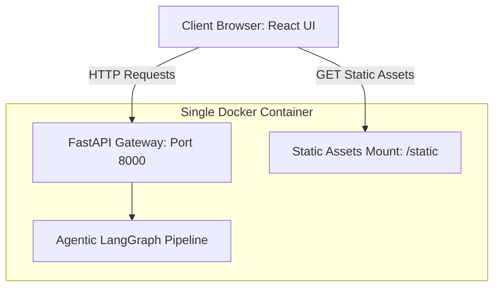
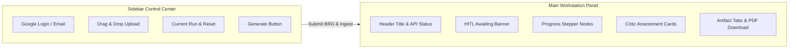

# React.js Migration Plan — EM Copilot UI Transition

> _TODO (Rahul): add a project-level disclaimer here if needed for the
> capstone submission. The disclaimer text was example placeholder._

This plan details the architecture, technical stack, effort estimation, and implementation phases to migrate the EM Copilot frontend from Streamlit to React.js.

## Current vs. Proposed Architecture

### Current Streamlit Architecture
Streamlit runs as a separate server-side process, communicating with the FastAPI backend over `localhost` via HTTP requests. The UI state is coupled to Streamlit's execution model (where the entire script re-runs on user interaction), which can lead to layout redraws and caching complexities.

### Proposed React.js Architecture
React runs as a single-page application (SPA) running entirely in the client's browser. It communicates with the FastAPI backend via REST API calls and Server-Sent Events (SSE). 

Because the backend is already fully decoupled, the **FastAPI codebase requires zero modifications**. The React app will integrate seamlessly with the existing backend endpoints.



### Migration Strategy (Parallel Deployment)

The React rewrite ships on a **new Cloud Run service** (`em-copilot-react`) without disturbing the existing Streamlit deployment on HuggingFace. The two run in parallel during the transition:

| | URL | Status during migration |
|---|---|---|
| Streamlit (v1) | `https://rganbote-em-copilot.hf.space/` | Kept live; no changes from this branch |
| React (v2) | `https://em-copilot-react-...run.app/` | New deploy from `dev-react-ui-upgrade` branch |

After the React version smoke-passes and gets one round of real BRD usage, the HuggingFace Space is paused (Settings → Pause Space) and the React URL becomes canonical. The HF Space remains as one-click-resumable rollback for ~30 days.

The Streamlit branch (`main`) and the React branch (`dev-react-ui-upgrade`) stay independent — no rebase. Bug fixes that need to land on both are cherry-picked.

### 3. Modular UI/UX Frontend Directory Architecture
We decouple features, styles, assets, global states, and custom hooks to follow industry-standard modular React architectural patterns, ensuring clear separation of concerns:

```
src/
├── assets/             # Static images, SVG icons, brand assets
├── components/         # Shared, stateless atomic UI components (shadcn/Radix primitives)
│   └── ui/
│       ├── Button.tsx
│       ├── Card.tsx
│       ├── Dropzone.tsx
│       ├── Slider.tsx
│       ├── Progress.tsx
│       ├── Accordion.tsx
│       └── Toast.tsx   # Sonner alert provider wrap
├── context/            # Global context state containers (Separation of Concerns)
│   ├── ThemeContext.tsx      # (v2) light/dark/auto + Liquid Glass — DEFERRED in v1, dark slate is hardcoded
│   ├── AuthContext.tsx       # Manages Google sign-in redirect details
│   └── WorkspaceContext.tsx  # Manages active Run ID, SSE event state, and cached artifacts
├── features/           # Modular, self-contained business domain feature modules
│   ├── auth/           # Login buttons and user avatar chip
│   ├── Ingestion/      # Landing upload dropzone, instructions, and empty state graph
│   ├── workspace/      # Timeline stepper, status panels, run monitors, SSE logs terminal
│   ├── artifacts/      # Tab containers, PDF export hooks, Plan/Schedule/Architecture content modules
│   ├── critic/         # Scoring grids, dimension cards, score history line charts
│   ├── hitl/           # Form inputs, EM rating sliders, Reject/Approve APIs, ElevenLabs convai widget
│   └── settings/       # (v2) Settings panel, appearance selectors, glass styles — DEFERRED in v1
├── hooks/              # Reusable, cross-feature business state hooks
│   ├── useSSE.ts       # SSE event connection and log parsing hooks
│   └── useLocalStorage.ts
├── lib/                # Third-party configurations and utility helper files
│   ├── api.ts          # Axios client config with base URL matching settings
│   └── utils.ts        # Dynamic Tailwind class merges (clsx + tailwind-merge)
├── styles/             # Stylesheets and global styling hooks
│   └── index.css       # Tailwind entry point and root custom theme variables mapping
└── types/              # Type definitions (PipelineState, LogEvent, CriticOutput)
```

---

## UI/UX Design System & Layout Architecture

To maintain the clean, user-friendly, and simple single-page layout of the Streamlit application while delivering an exceptionally premium, slick, and modern visual experience, the React frontend leverages a unified high-tech dark design system.

### 1. Unified Premium Dark Theme (Slate-950/Slate-900)
The entire application (both the initial Ingestion/Upload landing page and the active Workstation/HITL screen) is styled using a high-fidelity dark slate theme. **v1 ships dark-only**; the light theme toggle and Liquid Glass appearance options are deferred to v2 (the `ThemeContext` scaffolding is in place but only loads the dark palette).
* **Background Canvas**: Styled using deep, clean slate values (`bg-slate-950` for page backgrounds and `bg-slate-900` for cards and content containers).
* **Glowing Outlines & Borders**: Key interactive cards, inputs, and the dashed uploader dropzone border use thin indigo borders highlighted by subtle glowing outlines (`border-indigo-600/40 shadow-[0_0_15px_rgba(99,102,241,0.15)]`) to draw visual focus.
* **Modern Accents**:
  - *Indigo brand accents*: Used for active progress buttons, timeline indicators, checked icons, and highlights.
  - *Alert Red*: Active "Generate Engineering Plan" trigger overlays and HITL rejection highlights.
  - *Pulsing Green*: Success badges, approved final indicators, and system online states.
* **Premium Typography**: System sans-serif typeface hierarchy (e.g., *Inter*, *Outfit*, or *Roboto*) rendering crisp, anti-aliased content with high contrast for dark backgrounds.
* **Retro Dark-Mono streaming terminal**: Renders a black console log stream (`bg-black text-green-400 border-slate-800 font-mono`) under the left sidebar stepper showing live node events.
* **Micro-Animations**: All elements support hover-triggered scale adjustments (`hover:scale-[1.02]`), transitions on shadows, and slide-down dropdown transitions.

### 2. Layout Structure
* **Left Control Sidebar**:
  - **Auth Container**: A card displaying sign-in details (`Signed in: sairam1908@gmail.com`) alongside a small, styled "Sign out" link button.
  - **Upload Area**: A clean, dashed-border drag-and-drop zone (`border-dashed border-gray-300 bg-white hover:bg-gray-50/80 transition`) with a standard file format guide.
  - **Info Notices**: A blue information callout container ("Demo Purpose Only...") utilizing styled alert icons.
  - **Pipeline Trigger**: A primary red-tinted button ("Generate Engineering Plan") that highlights when a valid file is loaded.
  - **Current Run Monitor (Dark Slate Style)**: An active card displayed during progress or review:
    * *Run ID*: Monospace card badge with a copy-to-clipboard click indicator.
    * *Status Display*: Renders the pipeline stage (e.g., `Status: awaiting_hitl` with a clean green status text highlight).
    * *Reset Trigger*: A clear, borderless or light-bordered "Clear Plan & Reset" button to quickly restart the workflow.
  - **Advanced Settings**: A collapsible accordion panel with soft chevron animations for managing endpoint URLs.
* **Main Workstation Panel**:
  - **Header Block**: Title ("BRD → Engineering Plan") with API connection status indicators (pulsing green beacon for active status).
  - **HITL Alert Banner**: A warning yellow highlighted banner appearing when pipeline state reaches `awaiting_hitl`, complete with a "Scroll to Decision Gate" scroll trigger.
  - **Progress Timeline Stepper**: A horizontal chip stepper showing the current stage. Node backgrounds transition cleanly from gray to blue (active) or green (completed).
  - **Live Log Terminal**: A collapsible log drawer with auto-scroll and monospace log styling.
  - **Critic Card**: Visual scoreboards with metric thresholds and badge score indicators (e.g., "🟢 GREEN").
  - **Artifact Canvas**: Tabbed artifact viewport containing the PDF export action button and the confidentiality disclaimer text.



---

## Left Pane Business Steps & Global Navigation Tabs

To keep the UI professional and user-oriented, internal LangGraph execution details (such as node aggregators, state router branches, and raw transition names) are completely hidden from the client viewport. Instead, the Left Pane Stepper displays only 6 business-focused steps.

### 1. Left Pane Step Stepper
1. **Security Validation**: File format scan, size check, prompt injection assessment, and PII redaction status.
2. **Orchestrator BRD Parsing**: Status of document structure parsing and checking of required section metrics.
3. **Specialist Agent Run**: Grouped status showing progress of the 5 parallel spokes:
   - *Plan Generator*
   - *Schedule Estimator*
   - *Solution Architect*
   - *PoC Planner*
   - *Tech Stack Recommender*
4. **Quality Review**: Display of the Critic's grading scores and Green/Amber/Red badge result.
5. **Manager Approval**: Pause indicator showing that review action is required at the HITL confirmation gate.
6. **Finalization**: Shows the final decision status (e.g. "Approved & Exported to Jira" or "Rejected & Logged").

---

## Interactive Navigation & Tab Transitions

### 1. Premium Tab Transitions
Rather than instant switching, the artifacts panel uses `Framer Motion` for smooth layouts:
* **Slide-in Animation**: Tab content fades in (`opacity: 0 -> 1`) and slides slightly upwards (`y: 15px -> 0px`) over a `0.25s` ease-out transition.
* **Underline Indicator**: The active tab uses a layout-linked pill/bar (`layoutId` in Framer Motion) that glides fluidly behind/under the text when the user clicks a tab.

---

## Modern Loading States (Skeleton Screens)

To provide instant visual feedback and prevent jarring layout shifts, each artifact tab implements a dedicated skeleton screen mapping its exact structured format during generation:

* **Plan Skeleton**: Text block lines with pulsating gradient bar styles (`animate-pulse`) mirroring the phase headers, owner roles, and description rows.
* **Schedule Skeleton**: A mock table layout displaying skeleton cell rectangles instead of the sprint deliverables, showing the structure before the text parses.
* **Architecture Diagram Skeleton**: A large rounded canvas rectangle displaying a pulsating loading spinner (`lucide-react` Loader2 spinner) with a subtitle "Compiling Mermaid System Blueprint...".
* **Tech Stack Skeleton**: Structured horizontal card blocks showing pros and cons list outline lines.

---

## Robust Resiliency & Error Handling

Enterprise dashboards must never crash silently or block users. We will implement structural guardrails:

### 1. Granular Toast Notifications (`sonner`)
Use toast popups to alert users of non-blocking and blocking API states:
* **Granular Messaging**:
  - *Success*: "Jira Epic successfully created as EM-102"
  - *Warning*: "Google Sheets creds not configured — local CSV backup exported instead"
  - *Error*: "OpenAI API Key Quota Exceeded (401). Retrying in 5s..."
* **Auto-Dismiss**: Toasts slide in from the bottom-right and persist for 4s for errors, 2.5s for successes.

### 2. Localized Component Error Boundaries
If a complex sub-component fails (e.g. Kroki fails to render the Mermaid diagram SVG, or a pandas-like table parser encounters invalid JSON format), the dashboard wraps the view in an Error Boundary:
* **Fail-safe fallback**: Instead of crashing the entire page, only that specific tab displays a fallback box: *"Failed to render diagram. You can copy the raw Mermaid markup below."*
* **Recovery Action**: A "Retry Rendering" button to re-trigger compilation manually.

### 3. Accessibility (keyboard nav + ARIA)
Most accessibility is inherited free from shadcn/ui + Radix primitives. v1 explicitly commits to:
* **Keyboard navigation** through the timeline stepper (Tab + arrow keys cycle steps, Enter activates the active step's panel) and the artifact tabs.
* **ARIA labels** on the custom file dropzone (`role="button"`, `aria-label="Upload BRD file"`), the HITL slider (`aria-valuetext` with the current rating), and all icon-only buttons.
* **Focus rings** stay visible (Tailwind's `focus:ring-2 focus:ring-indigo-500`) — never `outline:none` without a replacement.

Internationalisation (i18n) is **deferred** to v2 — the entire UI is English-only in v1.

---

## Technical Stack Recommendations

We will utilize the following optimized npm library stack:

* **Build Tool & Framework**: **Vite + React (TypeScript)**.
* **Styling**: **Tailwind CSS** + **shadcn/ui** (radix-ui primitives).
* **HTTP & Fetching**: **@tanstack/react-query** (handles cache, automatic retries, and fetch state lifecycle) + **Axios**.
* **Animations**: **framer-motion** for sliding tabs and transition animations.
* **Iconography**: **lucide-react** for vector icon blocks.
* **Alert System**: **sonner** for lightweight, premium toast alerts.
* **Diagrams**: **mermaid** for client-side rendering compilation fallback.

---

## 7-Sprint Implementation Checklist & Effort Estimation

Revised v1 scope: dark-slate-only, OAuth Option C (static-served same-origin), no Settings page, no voice widget, no revision-loop UI. Includes a **Sprint 0** for test scaffolding and CI so quality is built in, not bolted on. **Sprint 5 (HITL + resiliency)** and **Sprint 6 (Docker + GCP deploy)** are separated — they were dangerously combined in v0.

| Sprint | Phase Title | Included Activities & Deliverables | Effort |
|---|---|---|---|
| **Sprint 0** | **Scaffold + Test Tooling + CI** | - `npm create vite@latest frontend -- --template react-ts`<br>- Install **Tailwind v4** + `@tailwindcss/vite` (CSS-only config — no `tailwind.config.js` / no `postcss.config.js`. Friendlier for a React-beginner ramp than v3.)<br>- shadcn/ui init: Button copied into `src/components/ui/` so we own the source<br>- Install: @tanstack/react-query, framer-motion, sonner, lucide-react, mermaid<br>- Vitest + React Testing Library + jsdom (Vitest reuses Vite's transform pipeline; no separate Jest)<br>- Smoke test: render `<App />`, assert no throw<br>- Playwright stub (one TODO E2E) — full E2E lands in Sprint 5<br>- GitHub Actions workflow `.github/workflows/react-ci.yml`: lint + typecheck + Vitest on every push to `dev-react-ui-upgrade`<br>- Move mockup PNGs → `docs/react_mockups/`, update relative paths | **1.5 days** |
| **Sprint 1** | **Theme Tokens & Layout Skeleton** | - (scaffold already done in Sprint 0)<br>- Tailwind dark slate palette tokens in `tailwind.config.ts`<br>- `ThemeContext` scaffold (single dark theme, toggle deferred to v2)<br>- `AgentWorkspace.tsx` layout skeleton (sidebar + main panel, dark slate from line 1)<br>- `WorkspaceContext` for active runId + SSE state + cached artifacts<br>- Storybook-style sandbox page to view raw components in isolation | **3 days** |
| **Sprint 2** | **Auth (Option C) & Ingestion Landing View** | - Wire FastAPI to serve React build at `/` (`StaticFiles(directory="dist", html=True)`)<br>- `AuthContext` reads `/auth/me` cookie session set by FastAPI's existing `google_auth.py`<br>- Ingestion landing: drag-drop uploader, file-format guide, demo-purpose-only notice, pipeline-explainer hub-and-spoke diagram | **3 days** |
| **Sprint 3** | **SSE Live Progress & Log Engine** | - `useSSE` hook with explicit event-type listeners (`pipeline_status`, `agent_complete`, `cache_hit`, `breaker_open`, `bulkhead_timeout`, `hitl_decision`, `export_complete`)<br>- Horizontal 6-step timeline stepper (Security → Orchestrator → Specialists → Critic → HITL → Decision)<br>- Retro dark-mono log console with event-type color coding (cyan = info, amber = retry, red = breaker_open)<br>- Sidebar "Current Run" card with status + reset | **3 days** |
| **Sprint 4** | **Artifact Canvas & Critic Rubrics** | - Tabbed canvas: Plan, Schedule, Architecture, PoC, Tech Stack<br>- Mermaid client-side render via mermaid@10 UMD build (parallel to the Streamlit fallback path we already shipped)<br>- Skeleton screens per tab (`PlanSkeleton`, `ScheduleSkeleton`, `ArchSkeleton`)<br>- Critic rubric card: 4-dimension scoreboard, Green/Amber/Red badge<br>- Mermaid source always shown below diagram (copy-out fallback) | **5 days** |
| **Sprint 5** | **HITL Gate & Resiliency Polish** | - `HITLApprovalGate`: reviewer field, EM rating slider, notes textarea, Approve/Reject buttons (notes required on reject)<br>- Sonner toast wiring for granular API messages (success/warning/error variants)<br>- API error interceptor (TanStack Query global onError)<br>- ErrorBoundary wrap on each major panel (Critic card, Artifact tabs, HITL gate) | **2 days** |
| **Sprint 6** | **Docker Bundling & GCP Deploy** | - Multi-stage Dockerfile: `node:20-alpine` build → `python:3.11-slim` runtime<br>- `npm ci && npm run build` → copy `dist/` into FastAPI image → mount via `StaticFiles`<br>- Update `start.sh` (Streamlit launch removed)<br>- Cloud Build trigger on push to `dev-react-ui-upgrade` (separate Cloud Run service `em-copilot-react`)<br>- Health-check endpoint `/health` returns 200 regardless of SPA route<br>- Smoke test on Cloud Run URL: full pipeline + HITL approve → exported | **1.5 days** |
| **Total** | — | **MMP shipped** | **19.5 days** (Sprint 0 +0.5, Sprint 1 -1, others unchanged) |

> **Honest sizing.** v0 of this plan estimated 12 days. After making the v1 cuts you approved (defer Settings / Liquid Glass / theme toggle / voice / revision-loop), the realistic figure is **~20 days solo**. The +8 days are not new scope — they are realistic accounting for: a single dark theme that needs to be applied across every component (not just "set a color variable"), genuine OAuth integration (not a `setRunId(Math.random())` placeholder), all 10+ SSE event types your backend emits, the Mermaid + Kroki fallback work we already did once on the Streamlit side, and Docker + Cloud Build wiring.
>
> If you're hard-capped at 12 days, the cuts that actually free up time are: (a) skip Playwright E2E, accept only Vitest + RTL — saves ~1 day; (b) Architecture tab shows Mermaid source only, no diagram render — saves ~1.5 days; (c) Critic card shows badge + overall score only, no per-dimension grid or score history — saves ~1 day. That gets you to ~16 days for a near-MMP. Anything below that is genuinely MVP and will look less polished than the Streamlit version you already have, which would defeat the purpose of the rewrite.

---

## Optional Polish: Custom Domain for v2 Launch (Post-Sprint 6)

The Cloud Run URL `em-copilot-1-809545615573.europe-west1.run.app` works but isn't memorable for a resume / portfolio link. **Not blocking for v1 or v2 launch** — defer this decision until React v2 ships and you're putting the link in front of recruiters.

> *I don't currently own a domain. This polish step happens after I buy one — probably the same week React v2 ships, so the launch URL is the canonical one from day 1.*

When ready, two cheap options:

| Option | Cost | Effort | When |
|---|---|---|---|
| **Cloud Run custom domain mapping** (e.g., `em-copilot.<your-domain>`) | Domain ~$12/yr | ~30 min mapping | After domain purchased |
| **Cloudflare proxy** → CNAME a subdomain at the Cloud Run URL | Free if you already own a domain | ~15 min | After domain purchased |

**Where to buy a domain:** Cloudflare Registrar (cheapest, no upsells, no whois grift), Porkbun (similar), or Namecheap. Pick something short and memorable — `emcopilot.dev`, `brd-to-plan.io`, `em-copilot.ai`. Avoid `.com` if it costs significantly more for an unmemorable variation — a clean `.dev` or `.io` reads better than `em-copilot-tool.com`.

**Cloud Run mapping steps when you have a domain:**

1. `gcloud beta run domain-mappings create --service em-copilot-react --domain em-copilot.<your-domain> --region europe-west1`
2. Add the CNAME record GCP gives you to your DNS provider
3. Wait ~5 min for SSL provisioning (Google handles the cert)
4. Update README link from `em-copilot-1-...run.app` → `em-copilot.<your-domain>`

Single PR, single CNAME, done.

---

## Core Component Code Blueprints

### 1. Skeleton Screen Component (`PlanSkeleton.tsx`)
Create a modern placeholder using Tailwind animations:

```tsx
import React from 'react';

export const PlanSkeleton: React.FC = () => {
  return (
    <div className="space-y-6 animate-pulse">
      {/* Meta header skeleton */}
      <div className="h-4 bg-slate-800 rounded w-1/4 mb-4" />
      <div className="h-3 bg-slate-800 rounded w-1/3 mb-8" />

      {/* Phase Skeletons */}
      {[1, 2, 3].map((i) => (
        <div key={i} className="p-4 bg-slate-900/50 border border-slate-800 rounded-lg space-y-4">
          <div className="h-5 bg-slate-800 rounded w-1/3" />
          <div className="space-y-2">
            <div className="h-3 bg-slate-800 rounded w-full" />
            <div className="h-3 bg-slate-800 rounded w-5/6" />
          </div>
          {/* Milestones grid mock */}
          <div className="grid grid-cols-4 gap-2 pt-2">
            <div className="h-8 bg-slate-800 rounded col-span-1" />
            <div className="h-8 bg-slate-800 rounded col-span-2" />
            <div className="h-8 bg-slate-800 rounded col-span-1" />
          </div>
        </div>
      ))}
    </div>
  );
};
```

### 2. Component Error Boundary (`ErrorBoundary.tsx`)
Prevent global page crashes on isolated component errors:

```tsx
import React, { Component, ErrorInfo, ReactNode } from 'react';

interface Props {
  children: ReactNode;
  fallback: ReactNode;
}

interface State {
  hasError: boolean;
}

export class ErrorBoundary extends Component<Props, State> {
  public state: State = { hasError: false };

  public static getDerivedStateFromError(_: Error): State {
    return { hasError: true };
  }

  public componentDidCatch(error: Error, errorInfo: ErrorInfo) {
    console.error("Uncaught component error:", error, errorInfo);
  }

  public render() {
    if (this.state.hasError) {
      return this.props.fallback;
    }
    return this.props.children;
  }
}
```
### 3. SSE Log Stream Hook (`useSSE.ts`)
Connect the client UI to the streaming backend logs:

```typescript
import { useState, useEffect, useCallback } from 'react';

export interface LogEvent {
  type: string;
  payload?: Record<string, any>;
  timestamp?: string;
}

export interface CriticDimension {
  score: number;
  threshold: number;
  passed: boolean;
}

export interface CriticOutput {
  revisionNumber: number;
  overallScore: number;
  badge: 'green' | 'amber' | 'red';
  dimensions: Record<string, CriticDimension>;
}

export interface ApprovalResult {
  decision: 'approved' | 'rejected';
  sheet_url?: string;
  jira_url?: string;
  rejection_count: number;
}

export const useSSE = (runId: string | null, apiBaseUrl: string) => {
  const [logs, setLogs] = useState<LogEvent[]>([]);
  const [pipelineStatus, setPipelineStatus] = useState<string>('idle');
  const [completedAgents, setCompletedAgents] = useState<Set<string>>(new Set());
  const [artifacts, setArtifacts] = useState<any | null>(null);
  const [elapsedSeconds, setElapsedSeconds] = useState<number>(0);
  const [tokenUsage, setTokenUsage] = useState<{ input: number; output: number } | null>(null);
  const [criticOutput, setCriticOutput] = useState<CriticOutput | null>(null);
  const [approvalResult, setApprovalResult] = useState<ApprovalResult | null>(null);

  const clearRun = useCallback(() => {
    setLogs([]);
    setPipelineStatus('idle');
    setCompletedAgents(new Set());
    setArtifacts(null);
    setElapsedSeconds(0);
    setTokenUsage(null);
    setCriticOutput(null);
    setApprovalResult(null);
  }, []);

  useEffect(() => {
    if (!runId) return;

    const es = new EventSource(`${apiBaseUrl}/status/${runId}`, { withCredentials: true });
    setPipelineStatus('initializing');
    const startTs = Date.now();
    const tick = setInterval(() => setElapsedSeconds((Date.now() - startTs) / 1000), 250);

    // Single onmessage works because backend currently emits default-event JSON.
    // If/when backend switches to typed `event:` lines, add addEventListener('cache_hit', ...) etc.
    es.onmessage = (event) => {
      try {
        const data = JSON.parse(event.data) as LogEvent;
        setLogs((prev) => [...prev, data]);

        switch (data.type) {
          case 'pipeline_status':
            setPipelineStatus(data.payload?.status || 'unknown');
            break;
          case 'agent_complete':
            if (data.payload?.agent) {
              setCompletedAgents((prev) => new Set(prev).add(data.payload!.agent));
            }
            break;
          case 'artifacts_update':
            setArtifacts(data.payload);
            break;
          case 'token_update':
            if (data.payload) setTokenUsage({ input: data.payload.input, output: data.payload.output });
            break;
          case 'critic_complete':
            setCriticOutput(data.payload as CriticOutput);
            break;
          case 'hitl_decision':
            setApprovalResult(data.payload as ApprovalResult);
            break;
          case 'pipeline_complete':
            setPipelineStatus(data.payload?.final_status || 'completed');
            clearInterval(tick);
            es.close();
            break;
        }
      } catch (e) {
        console.error('SSE parse error:', e);
      }
    };

    es.onerror = (err) => {
      console.error('SSE connection failed:', err);
      setPipelineStatus('error');
      clearInterval(tick);
      es.close();
    };

    return () => {
      clearInterval(tick);
      es.close();
    };
  }, [runId, apiBaseUrl]);

  return {
    logs,
    pipelineStatus,
    completedAgents,
    artifacts,
    elapsedSeconds,
    tokenUsage,
    criticOutput,
    approvalResult,
    clearRun,
  };
};
```

### 4. Sidebar and Main Workstation Layout (`AgentWorkspace.tsx`)
This component implements the main application workspace: a left control sidebar for files/auth, a scrollable main body. **Dark slate throughout** to match the v1 design language. The hook + props shape below is the corrected version — earlier drafts of this blueprint had `useSSE` returning a shape that didn't match what `AgentWorkspace` destructured.

> Notes on what this fixes vs the v0 blueprint:
> - `useSSE` now returns the full state the workspace needs (logs, status, completedAgents, artifacts, elapsedSeconds, tokenUsage, criticOutput, approvalResult, clearRun).
> - `triggerPipeline` actually POSTs the BRD to `/run-pipeline` (was a fake `Math.random()`).
> - `handleDownloadPDF` actually triggers a download (was a toast).
> - `<button>&times;</button>` replaced with `<X />` from lucide-react.
> - `text-gray-455` typo fixed (was no such Tailwind class).

> ⚠️  The code block below is the v0 light-theme version, kept for reference structure.
> Sprint 1's deliverable is to swap every Tailwind class to dark slate equivalents
> (`bg-gray-100` → `bg-slate-950`, `bg-white` → `bg-slate-900`, `text-gray-900` → `text-slate-100`,
> etc.) before any of this code goes into the repo. The structure stays; only the palette changes.

```tsx
import React, { useState, useEffect } from 'react';
import { useSSE } from './hooks/useSSE';
import { PlanSkeleton } from './components/PlanSkeleton';
import { ErrorBoundary } from './components/ErrorBoundary';
import { HITLApprovalGate } from './components/HITLApprovalGate';
import { X, LogOut, Upload, ShieldAlert, ChevronDown, ChevronUp, Download } from 'lucide-react';
import { toast } from 'sonner';

export const AgentWorkspace: React.FC = () => {
  const [userEmail, setUserEmail] = useState<string>("sairam1908@gmail.com");
  const [apiBaseUrl, setApiBaseUrl] = useState<string>("http://localhost:8000");
  const [isAdvancedOpen, setIsAdvancedOpen] = useState(false);
  const [selectedFile, setSelectedFile] = useState<File | null>(null);
  
  const [runId, setRunId] = useState<string | null>(null);
  const { logs, pipelineStatus, completedAgents, artifacts, elapsedSeconds, tokenUsage, criticOutput, approvalResult, clearRun } = useSSE(runId);
  const [activeTab, setActiveTab] = useState<'plan' | 'schedule' | 'arch' | 'poc' | 'stack'>('plan');

  // Business-focused steps list
  const steps = [
    { id: 1, label: 'Security Validation', agentKey: 'security' },
    { id: 2, label: 'Orchestrator parses BRD', agentKey: 'orchestrator' },
    { id: 3, label: '5 specialist agents run in parallel', agentKey: 'specialists' },
    { id: 4, label: 'Critic score', agentKey: 'critic' },
    { id: 5, label: 'HITL Confirmation gate', agentKey: 'hitl' },
    { id: 6, label: 'Decision - Approval/rejection', agentKey: 'decision' },
  ];

  const handleFileDrop = (e: React.DragEvent<HTMLDivElement>) => {
    e.preventDefault();
    if (e.dataTransfer.files && e.dataTransfer.files[0]) {
      setSelectedFile(e.dataTransfer.files[0]);
    }
  };

  const handleFileChange = (e: React.ChangeEvent<HTMLInputElement>) => {
    if (e.target.files && e.target.files[0]) {
      setSelectedFile(e.target.files[0]);
    }
  };

  const triggerPipeline = async () => {
    if (!selectedFile) return;
    const form = new FormData();
    form.append("file", selectedFile);
    try {
      const r = await fetch(`${apiBaseUrl}/run-pipeline`, { method: "POST", body: form, credentials: "include" });
      if (!r.ok) throw new Error(`HTTP ${r.status}`);
      const data = await r.json();
      setRunId(data.run_id);
      toast.success("Pipeline started");
    } catch (e: any) {
      toast.error(`Failed to start pipeline: ${e.message || e}`);
    }
  };

  const handleDownloadPDF = () => {
    if (!runId) return;
    // Triggers a browser download (FastAPI returns Content-Disposition: attachment)
    window.location.href = `${apiBaseUrl}/download/${runId}`;
  };

  return (
    <div className="flex h-screen bg-gray-100 text-gray-900 overflow-hidden font-sans">
      {/* Left Sidebar Control Panel */}
      <aside className="w-80 bg-gray-50 border-r border-gray-200 flex flex-col justify-between overflow-y-auto">
        <div className="p-6 space-y-6">
          {/* User Sign-In/Sign-Out Container */}
          <div className="bg-white p-4 rounded-lg border border-gray-200 shadow-sm space-y-3">
            <div className="flex items-center justify-between">
              <span className="text-xs text-gray-500 font-medium">Signed in:</span>
              <button 
                onClick={() => setUserEmail("")}
                className="text-xs text-blue-600 hover:underline flex items-center gap-1 font-semibold"
              >
                Sign out <LogOut size={12} />
              </button>
            </div>
            <div className="text-sm font-semibold text-gray-800 truncate">{userEmail || "Guest"}</div>
          </div>

          {/* Upload BRD Section */}
          <div className="space-y-3">
            <h3 className="text-sm font-bold text-gray-700 uppercase tracking-wider">Upload BRD</h3>
            <p className="text-xs text-gray-500">Drop a PDF, DOCX, or TXT BRD</p>
            
            <div 
              onDragOver={(e) => e.preventDefault()}
              onDrop={handleFileDrop}
              className="border-2 border-dashed border-gray-300 rounded-lg p-6 bg-white hover:bg-gray-50 transition cursor-pointer text-center relative"
            >
              <input 
                type="file" 
                onChange={handleFileChange} 
                accept=".pdf,.docx,.txt" 
                className="absolute inset-0 w-full h-full opacity-0 cursor-pointer"
              />
              <Upload className="mx-auto text-gray-400 mb-2" size={24} />
              <p className="text-xs font-semibold text-gray-600">Drag and drop file here</p>
              <p className="text-[10px] text-gray-400 mt-1">Limit 25MB per file • PDF, DOCX, TXT</p>
              <button className="mt-3 px-3 py-1.5 bg-gray-100 text-gray-700 border border-gray-300 rounded hover:bg-gray-200 text-xs font-medium">
                Browse files
              </button>
            </div>

            {selectedFile && (
              <div className="flex items-center justify-between p-2 bg-white rounded border border-gray-200 text-xs">
                <span className="truncate max-w-[180px] font-medium text-gray-700">{selectedFile.name}</span>
                <span className="text-gray-400 text-[10px] ml-2">{(selectedFile.size / 1024).toFixed(1)}KB</span>
                <button
                  onClick={() => setSelectedFile(null)}
                  className="text-slate-400 hover:text-red-400 ml-2"
                  aria-label="Remove selected file"
                >
                  <X size={14} />
                </button>
              </div>
            )}
          </div>

          {/* Demo Warning Banner */}
          <div className="bg-blue-50 border border-blue-200 p-4 rounded-lg flex gap-2">
            <ShieldAlert className="text-blue-500 shrink-0" size={16} />
            <p className="text-[11px] leading-relaxed text-blue-800">
              <strong>Demo Purpose Only:</strong> This application is for demo purposes only. The AI can make mistakes.
            </p>
          </div>

          {/* Trigger Button */}
          <button
            onClick={triggerPipeline}
            disabled={!selectedFile || !!runId}
            className={`w-full py-2.5 rounded-lg font-semibold text-sm transition flex items-center justify-center gap-2 ${
              !!runId 
                ? 'bg-gray-200 text-gray-400 border border-gray-300 cursor-not-allowed'
                : selectedFile 
                  ? 'bg-red-600 hover:bg-red-700 text-white shadow-md' 
                  : 'bg-gray-200 text-gray-400 border border-gray-300 cursor-not-allowed'
            }`}
          >
            Generate Engineering Plan
          </button>

          {/* Current Run Panel */}
          {runId && (
            <div className="border-t border-gray-200 pt-4 space-y-2">
              <h4 className="text-xs font-bold text-gray-500 uppercase tracking-wider">Current Run</h4>
              <div className="bg-gray-100 p-2 rounded font-mono text-xs text-gray-700 break-all select-all">
                {runId}
              </div>
              <div className="text-xs text-gray-600">
                Status: <span className="font-semibold text-green-600">{pipelineStatus || "Starting..."}</span>
              </div>
              <button
                onClick={() => {
                  setSelectedFile(null);
                  clearRun();
                  setRunId(null);
                }}
                className="w-full py-1.5 border border-gray-300 hover:bg-gray-100 rounded text-xs font-medium text-gray-700 transition"
              >
                Clear Plan & Reset
              </button>
            </div>
          )}
        </div>

        {/* Collapsible Advanced Settings Accordion */}
        <div className="border-t border-gray-200 bg-gray-100/50">
          <button 
            onClick={() => setIsAdvancedOpen(!isAdvancedOpen)}
            className="w-full px-6 py-4 flex items-center justify-between text-xs font-bold text-gray-600 hover:bg-gray-100/80 transition uppercase tracking-wider"
          >
            <span>⚙️ Advanced settings</span>
            {isAdvancedOpen ? <ChevronUp size={14} /> : <ChevronDown size={14} />}
          </button>
          {isAdvancedOpen && (
            <div className="px-6 pb-6 pt-2 space-y-3">
              <div>
                <label className="block text-[10px] font-bold text-gray-500 uppercase mb-1">API Base URL</label>
                <input 
                  type="text" 
                  value={apiBaseUrl} 
                  onChange={(e) => setApiBaseUrl(e.target.value)}
                  className="w-full bg-white border border-gray-300 rounded px-2.5 py-1.5 text-xs focus:ring-1 focus:ring-indigo-500 focus:border-indigo-500 outline-none text-gray-700 font-mono"
                />
              </div>
            </div>
          )}
        </div>
      </aside>

      {/* Main Workstation Panel */}
      <main className="flex-1 flex flex-col overflow-hidden bg-white">
        {/* Main Header */}
        <header className="h-16 border-b border-gray-200 px-8 flex items-center justify-between bg-white shrink-0">
          <div>
            <h1 className="text-lg font-bold text-gray-900">BRD → Engineering Plan</h1>
            <p className="text-xs text-gray-500">EM Copilot | Multi-Agent BRD-to-Engineering System with HITL</p>
          </div>
          <div className="flex items-center gap-2">
            <span className={`h-2.5 w-2.5 rounded-full ${runId ? 'bg-green-500' : 'bg-gray-400'}`} />
            <span className="text-xs font-semibold text-gray-600">
              {runId ? "API connected" : "API Offline"}
            </span>
          </div>
        </header>

        {/* Scrollable Workstation Body */}
        <div className="flex-1 overflow-y-auto p-8 space-y-8">
          {/* HITL Awaiting Alert Banner */}
          {pipelineStatus === "awaiting_hitl" && !approvalResult && (
            <div className="bg-yellow-50 border-l-4 border-yellow-500 p-4 rounded shadow-sm flex items-center justify-between">
              <div className="flex items-center gap-3">
                <span className="text-xl">⏸️</span>
                <div>
                  <h4 className="text-sm font-bold text-yellow-800">Action Required: Approval Needed</h4>
                  <p className="text-xs text-yellow-700">The multi-agent pipeline is paused. Please review the generated plans and approve below.</p>
                </div>
              </div>
              <a 
                href="#decision-gate" 
                className="px-4 py-2 bg-yellow-500 hover:bg-yellow-600 text-white font-semibold text-xs rounded transition shadow-sm shrink-0"
              >
                👇 Scroll to Decision Gate
              </a>
            </div>
          )}

          {/* Stepper Timeline Progress Nodes */}
          {runId && (
            <div className="space-y-4">
              <h3 className="text-sm font-bold text-gray-700 uppercase tracking-wider">Agents Pipeline progress</h3>
              <div className="grid grid-cols-6 gap-3">
                {steps.map((step) => {
                  const isCompleted = completedAgents.has(step.agentKey) || 
                    (step.agentKey === 'orchestrator' && artifacts?.brd_sections) ||
                    (step.agentKey === 'specialists' && artifacts?.plan_output) ||
                    (step.agentKey === 'critic' && artifacts?.critic_output) ||
                    (step.agentKey === 'decision' && approvalResult);
                  const isActive = !isCompleted && (
                    (step.agentKey === 'orchestrator' && pipelineStatus === 'initializing') ||
                    (step.agentKey === 'specialists' && pipelineStatus === 'dispatching') ||
                    (step.agentKey === 'critic' && pipelineStatus === 'critic_review') ||
                    (step.agentKey === 'hitl' && pipelineStatus === 'awaiting_hitl')
                  );
                  
                  return (
                    <div 
                      key={step.id}
                      className={`p-3 rounded-lg border text-center transition ${
                        isCompleted 
                          ? 'bg-green-600 border-green-700 text-white font-semibold' 
                          : isActive 
                            ? 'bg-blue-600 border-blue-700 text-white font-semibold animate-pulse'
                            : 'bg-gray-100 border-gray-200 text-gray-400'
                      }`}
                    >
                      <div className="text-xs truncate">
                        {isCompleted ? '✓' : isActive ? '⟳' : '○'} {step.label}
                      </div>
                    </div>
                  );
                })}
              </div>

              {/* Status and Performance Metrics Summary */}
              <div className="flex justify-between items-center text-xs text-gray-600 bg-gray-50 p-4 rounded-lg border border-gray-200">
                <div>
                  <strong>Current Status:</strong> <span className="text-gray-800">{pipelineStatus || "—"}</span>
                </div>
                <div>
                  <strong>Total Processing Time:</strong> <code className="bg-gray-200 px-2 py-0.5 rounded font-mono text-gray-800">{elapsedSeconds ? `${elapsedSeconds}s` : '—'}</code>
                </div>
                <div>
                  <strong>Tokens used (in / out):</strong> <code className="bg-gray-200 px-2 py-0.5 rounded font-mono text-gray-800">{tokenUsage ? `${tokenUsage.input.toLocaleString()} in / ${tokenUsage.output.toLocaleString()} out` : '—'}</code>
                </div>
              </div>
            </div>
          )}

          {/* Live Log Console */}
          {runId && (
            <details className="group border border-gray-200 rounded-lg overflow-hidden bg-white">
              <summary className="px-5 py-3 font-bold text-sm text-gray-700 bg-gray-50 border-b border-gray-200 cursor-pointer flex justify-between items-center list-none select-none">
                <span>Raw event log ({logs.length} events)</span>
                <ChevronDown className="text-gray-400 group-open:rotate-180 transition-transform" size={16} />
              </summary>
              <div className="p-4 bg-gray-950 text-gray-200 font-mono text-xs h-48 overflow-y-auto space-y-1">
                {logs.length === 0 ? (
                  <div className="text-gray-500 italic">No events yet...</div>
                ) : (
                  [...logs].reverse().map((log, i) => (
                    <div key={i} className="leading-relaxed">
                      <span className="text-gray-500">[{logs.length - i}]</span>{' '}
                      <span className="text-cyan-400">{log.type}:</span>{' '}
                      {JSON.stringify(log.payload)}
                    </div>
                  ))
                )}
              </div>
            </details>
          )}

          {/* Critic Rubric Scoring Cards */}
          {criticOutput && (
            <div className="space-y-4 border border-gray-200 rounded-xl p-6 bg-white shadow-sm">
              <div className="flex items-center justify-between border-b border-gray-100 pb-4">
                <div className="space-y-1">
                  <h3 className="text-sm font-bold text-gray-700 uppercase tracking-wider">Critic — Quality Assessment</h3>
                  <div className="text-xs text-gray-500">
                    Revision {criticOutput.revisionNumber} · Overall <strong className="text-gray-800">{criticOutput.overallScore.toFixed(2)} / 5.0</strong>
                  </div>
                </div>
                <span className={`px-4 py-1.5 rounded-full text-xs font-extrabold text-white uppercase tracking-wider ${
                  criticOutput.badge === 'green' ? 'bg-green-600' : criticOutput.badge === 'amber' ? 'bg-amber-500' : 'bg-red-600'
                }`}>
                  {criticOutput.badge === 'green' ? '🟢 GREEN' : criticOutput.badge === 'amber' ? '🟡 AMBER' : '🔴 RED'}
                </span>
              </div>

              {/* Metrics block */}
              <div className="grid grid-cols-4 gap-4 pt-2">
                {['groundedness', 'completeness', 'consistency', 'actionability'].map((metric) => {
                  const data = criticOutput.dimensions[metric];
                  return (
                    <div key={metric} className="p-4 bg-gray-50 rounded-lg border border-gray-200 text-center">
                      <div className="text-xs font-bold text-gray-500 uppercase tracking-wider capitalize">{metric}</div>
                      <div className="text-2xl font-extrabold text-gray-800 my-1">{data.score.toFixed(2)}</div>
                      <div className={`text-xs font-semibold ${data.passed ? 'text-green-600' : 'text-red-500'}`}>
                        {data.passed ? `✓ Passed (≥ ${data.threshold})` : `✗ Failed (≥ ${data.threshold})`}
                      </div>
                    </div>
                  );
                })}
              </div>
            </div>
          )}

          {/* Tabbed Viewport for Artifacts */}
          {artifacts && (
            <div className="space-y-4">
              <div className="flex items-center justify-between border-b border-gray-200 pb-2">
                <h3 className="text-base font-bold text-gray-900">Artifacts</h3>
                <button
                  onClick={handleDownloadPDF}
                  className="flex items-center gap-1.5 px-3 py-1.5 bg-gray-100 hover:bg-gray-200 text-gray-700 border border-gray-300 rounded text-xs font-bold transition"
                >
                  <Download size={14} /> Download PDF
                </button>
              </div>

              {/* Disclaimer notice banner — TODO replace text with project-level disclaimer */}
              <div className="bg-slate-900 border border-slate-800 p-4 rounded-lg text-xs leading-relaxed text-slate-300">
                <span className="font-bold text-slate-100 uppercase">Disclaimer:</span> This application is for demo purposes only. The AI can make mistakes.Validate before acting on them.
              </div>

              {/* Tabs list */}
              <div className="flex bg-gray-100 p-1 rounded-lg border border-gray-200 w-fit">
                {(['plan', 'schedule', 'arch', 'poc', 'stack'] as const).map((tab) => (
                  <button
                    key={tab}
                    onClick={() => setActiveTab(tab)}
                    className={`px-4 py-2 rounded-md text-xs font-bold capitalize transition-all ${
                      activeTab === tab 
                        ? 'bg-white text-gray-900 shadow-sm border border-gray-200' 
                        : 'text-gray-500 hover:text-gray-800'
                    }`}
                  >
                    {tab === 'arch' ? 'Architecture' : tab === 'stack' ? 'Tech Stack' : tab}
                  </button>
                ))}
              </div>

              {/* Tab Display Area */}
              <div className="border border-gray-200 rounded-xl p-6 bg-white shadow-sm min-h-[250px]">
                <ErrorBoundary fallback={<div className="p-4 bg-red-50 border border-red-200 text-red-700 rounded-lg text-sm">Failed to render artifact.</div>}>
                  {pipelineStatus === 'dispatching' ? (
                    <PlanSkeleton />
                  ) : (
                    <div>
                      {activeTab === 'plan' && <div>Plan content details...</div>}
                      {activeTab === 'schedule' && <div>Schedule Gantt deliverables table...</div>}
                      {activeTab === 'arch' && <div>Architecture diagram & Mermaid workflow...</div>}
                      {activeTab === 'poc' && <div>Proof of Concept scope...</div>}
                      {activeTab === 'stack' && <div>Tech stack matrices and rationale...</div>}
                    </div>
                  )}
                </ErrorBoundary>
              </div>
            </div>
          )}

          {/* Decision Gate Section */}
          {pipelineStatus === "awaiting_hitl" && (
            <div id="decision-gate" className="border-t border-gray-200 pt-8">
              <HITLApprovalGate runId={runId!} />
            </div>
          )}
        </div>
      </main>
    </div>
  );
};
```

### 5. Human-in-the-Loop Approval Gate (`HITLApprovalGate.tsx`)
This component displays approval inputs and action buttons when the pipeline pauses at `awaiting_hitl`. It aligns with the clean, light-themed visual styling of the workstation.

```tsx
import React, { useState } from 'react';
import { Check, X, ThumbsUp, AlertCircle } from 'lucide-react';
import { toast } from 'sonner';

interface HITLApprovalGateProps {
  runId: string;
}

export const HITLApprovalGate: React.FC<HITLApprovalGateProps> = ({ runId }) => {
  const [reviewer, setReviewer] = useState('Engineering Manager');
  const [rating, setRating] = useState(4);
  const [notes, setNotes] = useState('');
  const [isSubmitting, setIsSubmitting] = useState(false);

  const handleSubmit = async (decision: 'approved' | 'rejected') => {
    if (decision === 'rejected' && !notes.trim()) {
      toast.error("Please add notes explaining the reason for rejection.", {
        icon: <AlertCircle className="text-red-500" />
      });
      return;
    }

    setIsSubmitting(true);
    toast.info("Recording decision and exporting artifacts...", { duration: 1500 });
    
    try {
      const response = await fetch(`/approve/${runId}`, {
        method: 'POST',
        headers: { 'Content-Type': 'application/json' },
        body: JSON.stringify({
          decision,
          reviewer,
          notes,
          em_rating: rating,
        })
      });

      if (response.ok) {
        toast.success(`Pipeline successfully ${decision}!`, {
          icon: <ThumbsUp className="text-green-500" />
        });
      } else {
        toast.error("Failed to post decision. Please retry.");
      }
    } catch (err) {
      toast.error("Network connection failed.");
    } finally {
      setIsSubmitting(false);
    }
  };

  return (
    <div className="max-w-3xl mx-auto p-6 bg-white border border-gray-200 rounded-xl space-y-6 shadow-sm">
      <div className="flex items-center justify-between border-b border-gray-100 pb-3">
        <h3 className="text-sm font-bold text-gray-800 uppercase tracking-wider">Decision Gate</h3>
        <span className="px-2.5 py-1 rounded bg-yellow-50 border border-yellow-200 text-[10px] font-extrabold text-yellow-800 uppercase tracking-wider">
          Awaiting Manager Action
        </span>
      </div>

      <div className="bg-blue-50 border border-blue-200 p-4 rounded text-xs text-blue-800">
        Upon approval, the artifacts will be exported to Jira and this request is logged in EM Dashboard.
      </div>

      <div className="grid grid-cols-2 gap-6">
        <div>
          <label className="block text-xs font-bold text-gray-700 uppercase tracking-wider mb-2">Reviewer</label>
          <input 
            type="text" 
            value={reviewer} 
            onChange={(e) => setReviewer(e.target.value)}
            disabled={isSubmitting}
            className="w-full bg-white border border-gray-300 px-3 py-2 rounded text-sm focus:ring-1 focus:ring-indigo-500 focus:border-indigo-500 outline-none text-gray-800"
          />
        </div>
        <div>
          <label className="block text-xs font-bold text-gray-700 uppercase tracking-wider mb-2">
            EM Rating (1 = unusable • 5 = excellent): <span className="font-extrabold text-indigo-600">{rating}</span>
          </label>
          <input 
            type="range" 
            min={1} 
            max={5} 
            value={rating} 
            onChange={(e) => setRating(Number(e.target.value))}
            disabled={isSubmitting}
            className="w-full h-1.5 bg-gray-200 rounded-lg appearance-none cursor-pointer accent-indigo-600 mt-3.5"
          />
        </div>
      </div>

      <div>
        <label className="block text-xs font-bold text-gray-700 uppercase tracking-wider mb-2">
          Notes <span className="text-red-500">*Required if rejecting</span>
        </label>
        <textarea 
          placeholder="Provide context or feedback on output quality..." 
          value={notes}
          onChange={(e) => setNotes(e.target.value)}
          disabled={isSubmitting}
          className="w-full bg-white border border-gray-300 px-3 py-2 rounded text-sm focus:ring-1 focus:ring-indigo-500 focus:border-indigo-500 outline-none h-20 text-gray-800"
        />
      </div>

      <div className="flex justify-end gap-3 pt-2">
        <button
          onClick={() => handleSubmit('rejected')}
          disabled={isSubmitting}
          className="px-4 py-2 rounded-lg bg-white hover:bg-red-50 text-gray-700 hover:text-red-600 border border-gray-300 hover:border-red-200 transition flex items-center gap-2 text-xs font-bold"
        >
          <X size={14} />
          Reject Plan
        </button>
        <button
          onClick={() => handleSubmit('approved')}
          disabled={isSubmitting}
          className="px-4 py-2 rounded-lg bg-indigo-600 hover:bg-indigo-700 text-white shadow-sm transition flex items-center gap-2 text-xs font-bold"
        >
          <Check size={14} />
          Approve & Export
        </button>
      </div>
    </div>
  );
};
```

### 6. Theme Context (`ThemeContext.tsx`) — v1: dark-only scaffold

This context provider exists in v1 only as a hardcoded dark scaffold — the actual light/dark/auto toggle and Liquid Glass options are deferred to v2 (see decisions log). The structure below is what v2 will fill in; v1 just calls `applyDarkTheme()` once on mount and returns no setters.

```tsx
import React, { createContext, useContext, useState, useEffect } from 'react';

type Theme = 'light' | 'dark' | 'auto';
type GlassStyle = 'clear' | 'tinted';

interface ThemeContextType {
  theme: Theme;
  glassStyle: GlassStyle;
  setTheme: (theme: Theme) => void;
  setGlassStyle: (style: GlassStyle) => void;
}

const ThemeContext = createContext<ThemeContextType | undefined>(undefined);

export const ThemeProvider: React.FC<{ children: React.ReactNode }> = ({ children }) => {
  const [theme, setTheme] = useState<Theme>(() => (localStorage.getItem('theme') as Theme) || 'auto');
  const [glassStyle, setGlassStyle] = useState<GlassStyle>(() => (localStorage.getItem('glass-style') as GlassStyle) || 'clear');

  useEffect(() => {
    const root = window.document.documentElement;
    let resolvedTheme = theme;

    if (theme === 'auto') {
      resolvedTheme = window.matchMedia('(prefers-color-scheme: dark)').matches ? 'dark' : 'light';
    }

    if (resolvedTheme === 'dark') {
      root.classList.add('dark');
      root.style.colorScheme = 'dark';
    } else {
      root.classList.remove('dark');
      root.style.colorScheme = 'light';
    }

    localStorage.setItem('theme', theme);
  }, [theme]);

  useEffect(() => {
    const root = window.document.documentElement;
    if (glassStyle === 'clear') {
      root.classList.add('glass-clear');
      root.classList.remove('glass-tinted');
    } else {
      root.classList.add('glass-tinted');
      root.classList.remove('glass-clear');
    }
    localStorage.setItem('glass-style', glassStyle);
  }, [glassStyle]);

  return (
    <ThemeContext.Provider value={{ theme, glassStyle, setTheme, setGlassStyle }}>
      {children}
    </ThemeContext.Provider>
  );
};

export const useTheme = () => {
  const context = useContext(ThemeContext);
  if (!context) throw new Error('useTheme must be used within a ThemeProvider');
  return context;
};
```

### 7. Settings Page (`SettingsPanel.tsx`) — DEFERRED to v2

The Settings page (Appearance toggle, Liquid Glass selector, notification badges, profile chip) was scoped in v0 but is **deferred to v2**. v1 ships dark-only; users have no theme controls. When v2 adds the toggle, the `ThemeContext` from §6 already supports it — the only new code needed is the `SettingsPanel.tsx` view itself and a navigation entry point (`react-router-dom` becomes a dependency at that point).

---

## Decisions Log (v1 scope)

For reviewer clarity — these are the deliberate cuts vs the v0 plan:

| Topic | v0 Plan | v1 Decision | Rationale |
|---|---|---|---|
| Theme | Light/Dark/Auto + Liquid Glass selector | **Dark slate hardcoded** | Matches mockups; toggle is polish, not value |
| OAuth | Choice between Options A/B/C | **Option C (static-served, same-origin)** | No new FastAPI changes; reuses existing `google_auth.py` |
| Voice approval | ElevenLabs widget in Sprint 5 | **DEFERRED** | Approve/Reject buttons are sufficient for MMP |
| Revision-loop UI | Score history + diff view | **DEFERRED** | One-shot Critic display; revisions visible only in log console |
| Settings page | Sprint 1 deliverable | **DEFERRED to v2** | Removes a sprint of work; users don't lose function |
| `react-router-dom` | In stack list | **NOT added in v1** | Single-screen app, state-driven conditional render |
| i18n | Not addressed | **English-only, deferred** | Capstone scope |
| Streamlit version | Replaced | **Kept live on HuggingFace** | Parallel deployment; React on GCP Cloud Run |
| Test scaffolding | Implicit (none in v0) | **Sprint 0 explicit** | Vitest + RTL + Playwright + GitHub Actions |

---

*Plan revised on 2026-06-16 based on review of v0. Next action: Sprint 0 kickoff.*
